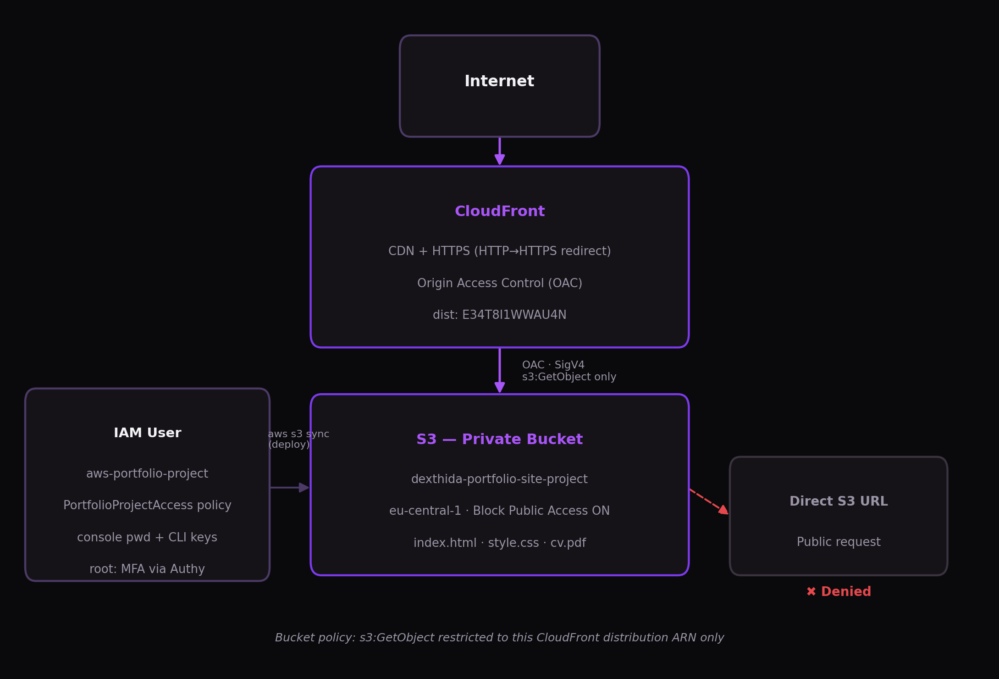

# Secure Static Portfolio on AWS

A personal portfolio/CV site deployed on AWS using a private-origin, CDN-fronted static hosting architecture — built to demonstrate practical AWS architecture, IAM, and security decisions rather than application code.

**Live site:** https://d2udnhhz7y9ums.cloudfront.net

---

## Architecture



```
Internet
   │  HTTPS
   ▼
CloudFront (CDN, dist: E34T8I1WWAU4N)
   │  Origin Access Control (OAC) · SigV4-signed request · s3:GetObject only
   ▼
S3 — private bucket (dexthida-portfolio-site-project, eu-central-1)
```

The bucket is **never** publicly reachable. Every request — whether from a browser or from `curl` directly against the S3 URL — is denied unless it comes from CloudFront via OAC.

## AWS services used

| Service | Purpose |
|---|---|
| **S3** | Origin storage for static site files (HTML/CSS/PDF), fully private |
| **CloudFront** | CDN, HTTPS termination, HTTP→HTTPS redirect, global edge caching |
| **IAM** | Dedicated least-privilege user/policy for all project operations (no root usage) |
| **Lambda** | Automated cache invalidation on deploy |
| *(planned)* CloudWatch | Logs/metrics/alarms for the distribution |

## Security model

This project deliberately avoids the common "S3 static website hosting + public bucket" tutorial pattern. Instead:

- **Block Public Access** is enabled on the bucket — no ACLs, no public bucket policy, no exceptions.
- **CloudFront Origin Access Control (OAC)** is the only path into the bucket. CloudFront signs its requests to S3 with SigV4; the bucket policy grants `s3:GetObject` **only** to this specific distribution's ARN, and no other action (no `PutObject`, `DeleteObject`, `ListBucket`, etc.).
- **Verified, not assumed:** direct requests to the S3 object URL were tested and confirmed denied; the site is only reachable through the CloudFront domain.
- **IAM:** all provisioning and deployment is done through a dedicated `aws-portfolio-project` IAM user with a customer-managed policy (`PortfolioProjectAccess`), scoped to the services this project needs (S3, CloudFront, Lambda, CloudWatch Logs, plus the narrow IAM permissions required to create/pass a Lambda execution role). Root is used only for account-level setup and has MFA enabled.
- **Current limitation, tracked as a next step:** the IAM policy is service-scoped rather than fully resource-level (e.g. `cloudfront:*` rather than restricted to the one distribution ARN). Tightening this to resource-level least privilege is planned — see [Roadmap](#roadmap).

## Deployment process (current — manual)

## Deployment process

Pushing to `main` (with changes under `site/`) triggers a GitHub Actions workflow
([`.github/workflows/deploy.yml`](.github/workflows/deploy.yml)) that syncs the site
to S3. Cache invalidation still happens automatically via the Lambda trigger.

Authentication uses **OIDC** — GitHub presents a short-lived signed token directly to
AWS STS to assume `github-actions-deploy-portfolio`, and no AWS credentials are stored
in GitHub at all (no access keys, nothing to leak or rotate).

## Cost considerations

Designed to stay effectively free/negligible at portfolio-site traffic levels:

- **S3 & CloudFront:** within AWS's free-tier allowances (5GB storage / 1TB CDN egress per month) for a new-ish account; even outside free tier, storage and request costs for a few static files are fractions of a cent.
- **No Route 53 / custom domain** — using CloudFront's default domain avoids the $0.50/month hosted-zone charge and domain registration cost.
- **No RDS, no always-on compute, no WAF** — nothing in this architecture bills by the hour.
- An **AWS Budget alarm ($5/month threshold)** is configured on the account as a safety net before any resource was created.

## Lessons learned

- The CloudFront **origin path** setting is a path *inside* the bucket (e.g. a subfolder), not the bucket name itself — an early misconfiguration here caused 403s until corrected to empty.
- OAC (the current AWS-recommended pattern) replaces the older Origin Access Identity (OAI) approach and integrates directly with SigV4 signing rather than a separate CloudFront "canonical user" — worth understanding the distinction when it comes up on the AWS Solutions Architect Associate exam.
- Manually running `s3 sync` + `create-invalidation` after every change is a natural first pass, but it's exactly the kind of repetitive, error-prone step that automation (Lambda, or a CI/CD pipeline) exists to remove — motivating the next phase of this project.
- GitHub rolled out a newer, immutable-ID format for the OIDC `sub` claim
  (`repo:owner@id/repo@id:ref:...`), different from the human-readable
  `repo:owner/repo:ref:...` format most OIDC tutorials show. Diagnosed via
  CloudTrail (checking the actual `sub` value AWS received on the failed
  `AssumeRoleWithWebIdentity` call) and updated the trust policy's condition
  to match — a good reminder to verify federated-identity claims against
  the real request rather than assuming documentation examples are current.

## Roadmap

- [x] CI/CD: replace manual `s3 sync` + invalidation with an automated git-push-triggered deployment
- [x] Lambda: automated CloudFront invalidation triggered by an S3 upload event
- [ ] CloudWatch: logs, metrics, and at least one alarm
- [ ] IAM: tighten `PortfolioProjectAccess` from service-level to resource-level least privilege
- [ ] Infrastructure as Code (Terraform or CloudFormation) for a fully reproducible environment

*Lambda, CloudWatch, CI/CD, and IaC are not yet implemented — this README will be updated as each is completed.*

## Related

- Companion project: [Self-Hosted Cloud Infrastructure Homelab](https://github.com/leon-mihaljevic/home-lab) — the on-prem counterpart to this AWS deployment (Proxmox, Docker, NAS, monitoring).

---

Built by Leon Mihaljević ([@leon-mihaljevic](https://github.com/leon-mihaljevic)) while preparing for the AWS Solutions Architect Associate certification.
